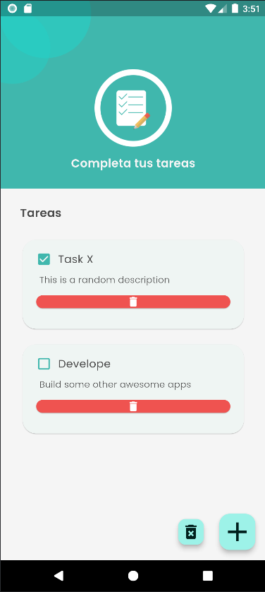
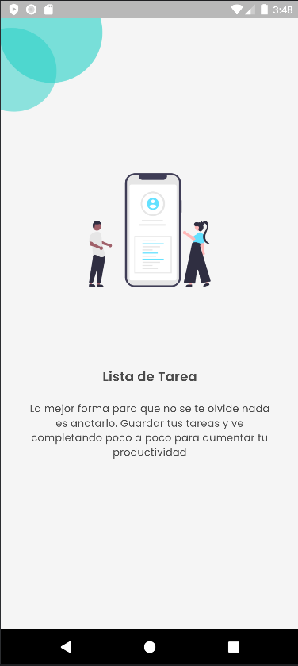
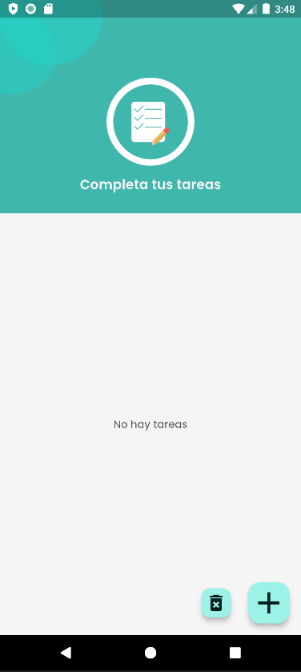
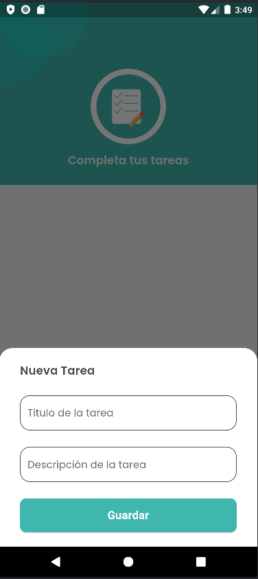

# To-Do List App

## Description
This project is a to-do list application developed using Flutter and Dart, designed to be executable on both iOS and Android platforms.

Despite its simplicity, the app is built on a robust programming foundation, providing a comprehensive base for developing more complex applications.

It effectively demonstrates essential programming concepts and practices, making it a valuable resource for understanding core app development principles.

## Application Features
A project primarily designed to practice solid Flutter fundamentals. This project encompasses a variety of techniques and principles that can be applied to develop any application.

## Figma Design Link
For a detailed visual design, you can check the Figma link below:
[App Design on Figma](https://www.figma.com/design/VV4W7yS63z1lc9UgbWiDeZ/App-de-tareas?node-id=0-1&t=pvFggfvnBnfioJwO-1)

## Screenshots
Here are some screenshots of the app in action:

